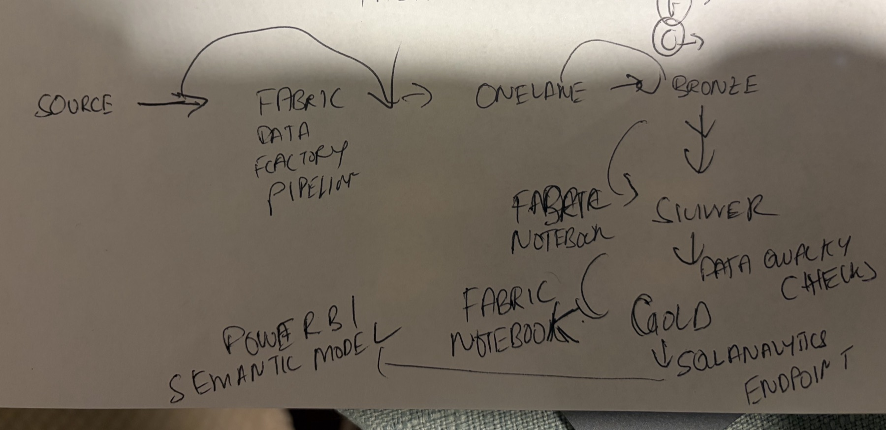

# data on Microsoft Fabric

Continuous auditing of **transfers of value to healthcare professionals**, built on
[CMS Open Payments](https://www.cms.gov/openpayments/explore-the-data/dataset-downloads.html)
data with a medallion lakehouse on Microsoft Fabric.

Corporate Audit Services must provide assurance over payments to HCPs — an
anti-kickback / Sunshine Act exposure near the top of any pharma audit universe.
Today that assurance is sample-based, manual and retrospective. This platform makes
it **full-population, risk-ranked and continuous**.

---

## The prompt this was built from

> write placeholder factory scripts for data ingestion from source or dataset to
> onelake/lakehouse files , then script to copy to bronze, script for data elt from
> bronze to silver, then script for data quality checks - duplicates, then script for
> silver to gold. These scripts will be orchestrated by data factory

---

## Original design sketch

The architecture was drawn before any code was written:



`SOURCE → Fabric Data Factory Pipeline → OneLake → Bronze → Silver → Data Quality
Checks → Gold → SQL Analytics Endpoint → Power BI Semantic Model`, with Fabric
notebooks doing the work between layers. The implementation below follows it, with
one addition that emerged during the build: the data quality gate runs after *every*
layer rather than only between Silver and Gold.

---

## Pipeline flow

Orchestrated by a Fabric Data Factory pipeline
(`orchestration/pipeline-content.json`). The two Bronze branches run in parallel;
every layer is gated by a data quality check that **fails the run** rather than
letting bad data reach the semantic model.

```
                      CMS Open Payments bulk CSV
                    (GNRL / RSRCH / OWNRSHP, PY2024-25)
                                  │
                                  ▼
                 ┌────────────────────────────────────┐
                 │ 00  Ingest_Source_To_Files         │
                 │     source ──▶ OneLake Files       │
                 │     + manifest (fingerprint, PY)   │
                 └────────────────┬───────────────────┘
                                  │  manifest_path
                    ┌─────────────┴─────────────┐
                    ▼                           ▼
     ┌──────────────────────────┐  ┌──────────────────────────┐
     │ 01  Bronze_General       │  │ 01  Bronze_Research      │
     │     Files ──▶ Delta      │  │     Files ──▶ Delta      │
     │     + lineage cols       │  │     + lineage cols       │
     │     + quarantine corrupt │  │     + quarantine corrupt │
     └────────────┬─────────────┘  └────────────┬─────────────┘
                  ▼                             ▼
     ┌──────────────────────────┐  ┌──────────────────────────┐
     │ 03  DQ_Bronze_General    │  │ 03  DQ_Bronze_Research   │
     │     unique(Record_ID)    │  │     unique(Record_ID)    │
     │     not_null, row_count  │  │     not_null, row_count  │
     └────────────┬─────────────┘  └────────────┬─────────────┘
                  └─────────────┬───────────────┘
                                ▼   (waits for BOTH gates)
                 ┌────────────────────────────────────┐
                 │ 02  Silver_Payments                │
                 │     type ▸ cleanse ▸ conform       │
                 │     ▸ entity-resolve ▸ DEDUPLICATE │
                 │     GENERAL + RESEARCH ─▶ one grain│
                 └────────────────┬───────────────────┘
                                  ▼
                 ┌────────────────────────────────────┐
                 │ 03  DQ_Silver_Payments             │
                 │     unique(payment_id)  ◀ duplicates
                 │     not_null, non_negative,        │
                 │     accepted_values, row_count     │
                 └────────────────┬───────────────────┘
                                  ▼
                 ┌────────────────────────────────────┐
                 │ 04  Gold_Star_Schema               │
                 │     dim_recipient   dim_manufacturer
                 │     dim_nature      dim_date       │
                 │     fact_payment                   │
                 │     + OPTIMIZE / V-Order (Fabric)  │
                 └────────────────┬───────────────────┘
                                  ▼
                 ┌────────────────────────────────────┐
                 │ 03  DQ_Gold_Fact_Payment           │
                 │     referential keys, unique grain │
                 └────────────────┬───────────────────┘
                                  ▼
                    Direct Lake semantic model
                                  │
                   ┌──────────────┴──────────────┐
                   ▼                             ▼
          Power BI audit dashboard      AI-Ready semantic layer
                                          (Claude / MCP)

  any DQ gate fails ──▶ Notify_On_Failure (Outlook)
                        Gold is NOT refreshed; the semantic model
                        still reflects the last good run
```

---

## Stages

| # | Notebook | Does |
|---|---|---|
| 00 | `00_ingest_source_to_files.py` | Lands raw extracts in OneLake `Files` untouched; writes a manifest (name, size, program year, fingerprint). Rejects files that break the CMS naming contract. |
| 01 | `01_files_to_bronze.py` | CSV ▸ partitioned Delta. Stamps lineage columns, quarantines unparseable rows instead of dropping them silently. |
| 02 | `02_bronze_to_silver.py` | Typing, cleansing, conforming, entity resolution, deduplication. Unions General + Research onto one payment grain. |
| 03 | `03_data_quality_checks.py` | Generic gate, called after **every** layer with a different `pipeline` param. Appends results to a Delta ops table. |
| 04 | `04_silver_to_gold.py` | Builds the star schema for Direct Lake. Dimensions before fact, then `OPTIMIZE`. |

One DQ notebook serves all four gates — one tested gate beats four near-identical copies.

---

## Design notes

**Same code, two runtimes.** `config/env/local.yaml` and `config/env/fabric.yaml`
differ only in path roots and sampling. Pipeline definitions
(`config/pipelines/*.yaml`) are identical in both. Notebooks never hardcode a path.

**Declarative expectations.** Data quality lives in the pipeline YAML, not as ad-hoc
asserts in notebooks:

```yaml
expectations:
  - type: unique              # headline duplicate control
    columns: [payment_id]
    severity: error           # error fails the run; warn records and continues
```

**The pipeline audits itself.** Every check writes to `Tables/ops/dq_results` with a
run id, so CAS can evidence that controls over the data pipeline were operating —
auditors get audited too.

**Explainability over cleverness.** Risk scoring (planned) uses transparent rules
that emit an evidence blob, not an opaque model. A finding that cannot be explained
to an auditee is not a usable finding.

---

## Running locally

Local execution needs no Fabric capacity and runs the same stage sequence Data
Factory orchestrates.

```bash
./run_local.sh
```

Requires Java 17 and a Python 3.11 venv with `pyspark==3.5.3` + `delta-spark==3.2.1`
— versions chosen to match **Fabric Runtime 1.3**, so local behaviour mirrors the
Fabric Spark pool.

Last verified run: **exit 0, 16/16 DQ checks passed, ~80s**, 316,012 Silver rows.

---

## Notes from the build

Things that only surfaced by actually running it:

- **CMS embeds newlines inside quoted fields** (~2 per million rows), so the reader
  needs `multiLine=true` — which makes the CSV *unsplittable*. That single-task cost
  is paid once during the Delta conversion; every read afterwards is parallel. Local
  stages read a head extract so a laptop is not stuck single-threaded on 9.2 GB.
- **Submitter names have no casing convention.** `PFIZER INC.` sits beside
  `AstraZeneca Pharmaceuticals LP` in the same extract. A case-sensitive peer filter
  silently hid 74% of the relevant population (81k ▸ 316k rows once fixed).
- **Sanofi reports under three separate legal entities** (Pasteur, Aventis, US
  Services). Rolling a corporate family up to one parent needs a curated crosswalk,
  not a regex — flagged as a TODO rather than faked.
- **A YAML `null` is not "unset"** unless you make it so; `land_mode: null` overrode
  its own default and copied 11 GB instead of symlinking.

---

## Status

Built and verified: stages 00–04, DQ engine, Data Factory pipeline definition.

Next: R1–R5 risk rules + `fact_risk_score`, pytest suite, explicit Bronze schemas,
Direct Lake semantic model, Power BI dashboard, Claude/MCP semantic layer.
